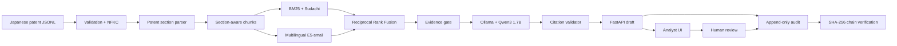

# Japanese Patent Intelligence RAG

[](https://github.com/Lee2379/jp-patent-intelligence-rag/actions/workflows/ci.yml)


[日本語](README_ja.md) · **English**

A fully local, multilingual technical prior-art exploration assistant for Japanese AI patents.
It combines patent-aware parsing, Japanese lexical retrieval, multilingual embeddings,
grounded local generation, citation-level source inspection, human review, and a
tamper-evident audit trail.

> **Technical prior-art exploration assistant — not legal advice.** No cloud account, API key,
> paid API, or metered service is required.

## Data provenance and preparation

The development corpus is the `ja_patent` subset of **LLM-jp Corpus v4**, published by the
LLM-jp Corpus Building Working Group (NII) and mirrored on Hugging Face. The repository does
not redistribute the corpus; it contains manifests, validation evidence, and reproducible
processing code only.


*Figure 1. Japanese patent corpus used as the initial development dataset. The corpus contains
approximately 4.68 million documents and is distributed under CC BY 4.0.*


*Figure 2. Reproducible sampling manifest. A deterministic year-stratified sample of 46,794
documents was created from an estimated 4,679,385 source records; each curated shard records
its SHA-256 checksum.*


*Figure 3. Corpus integrity validation. All 46,794 records passed gzip, UTF-8, and JSON
validation, with zero missing patent-text records.*


*Figure 4. Raw Japanese patent record containing a machine-learning abstract, independent
claim, publication metadata, and traceable source path.*

| Data contract | Value |
|---|---:|
| Upstream estimate | 4,679,385 Japanese patent records |
| Reproducible sample | 46,794 records (1.000003%) |
| Coverage | 2004, 2007, 2011, 2014, 2017, 2020 |
| Publication kind | `A` — public patent applications |
| Valid / invalid / empty | 46,794 / 0 / 0 |
| Indexed AI-domain documents | 505 |

See [DATASET_README.md](DATASET_README.md), [DATASET_MANIFEST.json](DATASET_MANIFEST.json),
and the [local dataset card](docs/sources/LLM_JP_DATASET_CARD.md) for provenance and attribution.

## Product overview


*Local Japanese Patent Intelligence RAG — hybrid retrieval, multilingual answers, and fully
local inference.*

The interface is an analyst workspace rather than a generic chat demo. It exposes corpus scope,
filters, retrieval mode, model state, evidence policy, source passages, reviewer decisions, and
audit receipts in one workflow.

## What this project demonstrates

- **Japanese patent NLP:** Unicode normalization and section-aware extraction of abstracts,
  individual claims, technical fields, backgrounds, and detailed descriptions.
- **Hybrid information retrieval:** Sudachi-tokenized BM25 and multilingual E5-small dense
  retrieval, fused through Reciprocal Rank Fusion instead of mixing incompatible raw scores.
- **Multilingual search:** Japanese answers plus Korean/English query support, with transparent
  Korean-to-Japanese patent-term expansion on the lexical branch.
- **Grounded local generation:** Ollama `qwen3:1.7b`, bounded evidence prompts, allow-listed
  `[S#]` citations, evidence gating, and extractive fallback or abstention on failure.
- **Operational AI controls:** independent human approve/revise/reject decisions and append-only
  SHA-256-linked events for prompts, passages, outputs, timings, and reviews.
- **Engineering discipline:** typed FastAPI contracts, Docker Compose, deterministic tests,
  retrieval evaluation, Ruff, strict mypy, CI, runbooks, model card, and threat boundaries.

## End-to-end architecture


*End-to-end local RAG architecture — Japanese patent ingestion, section-aware parsing, hybrid
retrieval, grounded generation, and governance.*



The local model receives only retrieved passages that pass the configured evidence threshold.
It has no browser, shell, tools, or write access. API text is escaped before UI rendering, and
Docker ports bind to `127.0.0.1`.

## Grounded answer and citation traceability

<details>
<summary><strong>View a Japanese answer with evidence scores and [S1]/[S2] citations</strong></summary>


*Grounded generation — the analyst sees evidence status, model, latency, Japanese answer,
inline citations, and ranked source passages.*

</details>

Every answer citation is interactive and opens the exact patent section used to support the
claim.

<details>
<summary><strong>View citation-level source inspection</strong></summary>


*Citation-level traceability — each generated claim opens the exact supporting passage from
the original Japanese patent, including publication number, year, section, and local source
path.*

</details>

## Human-in-the-loop review


*Human-in-the-loop review gate — every generated answer requires an independently recorded
approval, revision, or rejection decision.*

Answers begin in `pending`. The reviewer label must differ from the analyst label, and a new
decision event is recorded without overwriting the generated draft. These labels are workflow
identifiers for this local portfolio build, not authenticated identities.

## Tamper-evident audit trail


*Tamper-evident audit trail — prompts, retrieval evidence, model outputs, and human decisions
are linked through an append-only SHA-256 chain.*

Each canonical JSON event stores the preceding event hash. Verification recomputes the chain
and reports the checked event count, current head hash, and validity. This makes silent edits
detectable; production deployment would additionally require authenticated users, access
control, remote immutable storage, retention policy, and external timestamps.

## Evaluation

| Check | Result | Interpretation |
|---|---:|---|
| Japanese silver benchmark, 30 queries | Recall@5 **1.000**, MRR@10 **1.000** | Deterministic retrieval regression test |
| Korean/English smoke set, 6 queries | Recall@5 **1.000**, MRR@10 **0.700** | Cross-lingual path smoke check |
| Citation invariants | Enforced | Only retrieved source IDs may be cited |
| Quality gates | Ruff, strict mypy, **30 tests** | Local and CI verification |
| Docker E2E | Retrieval → Ollama → review → valid audit chain | Full workflow check |

These results are engineering regression checks, not a statistically powered relevance study
or expert patentability opinion. The Japanese benchmark is abstract-derived, and the multilingual
set is intentionally small. See [Evaluation](docs/EVALUATION.md) and the
[Model Card](docs/MODEL_CARD.md) for methodology and limitations.

## Quick start

Prerequisites: Docker Desktop and Python 3.11. An NVIDIA GPU is optional; CPU inference works.
Source data and generated indexes are intentionally excluded from Git.

```powershell
git clone https://github.com/Lee2379/jp-patent-intelligence-rag.git
cd jp-patent-intelligence-rag
Copy-Item .env.example .env
uv sync --dev

docker compose up -d ollama
docker compose --profile setup run --rm model-init
docker compose --profile setup run --rm embedding-init

uv run patent-rag prepare
uv run patent-rag report
uv run patent-rag build-index
uv run patent-rag evaluate
docker compose --profile app up -d --build
```

Open `http://127.0.0.1:8000`; the audit console is at
`http://127.0.0.1:8000/audit`. The corpus must first be placed under the paths documented in
[DATASET_README.md](DATASET_README.md). For native execution, CPU Compose overrides, health
checks, and troubleshooting, use the [Runbook](docs/RUNBOOK.md).

## Repository map

```text
apps/web/                 responsive analyst and audit interfaces
src/patent_rag/parsing/   Japanese patent section parser
src/patent_rag/pipeline/  validation, normalization, chunking, reports
src/patent_rag/retrieval/ BM25, dense retrieval, RRF, evaluation
src/patent_rag/generation/ Ollama prompting and citation guard
src/patent_rag/api/       FastAPI application and typed contracts
src/patent_rag/audit.py   append-only SQLite events and hash-chain verification
tests/                    deterministic unit and API tests
docs/                     architecture, evidence, evaluation, runbook, model card
```

## Design decisions and limitations

- In-memory dense search is appropriate for this 505-document AI subset; full-corpus scaling
  should use a disk-backed ANN index and incremental ingestion.
- The corpus does not include complete live legal status, applicant, CPC/FI, or citation-network
  metadata. Those fields require an authorized, current JPO source.
- A valid hash chain detects local mutation but does not provide identity, authorization, or
  external timestamp guarantees.
- Generated text is always a reviewable technical-search draft. It must not be used as a
  patentability, infringement, validity, FTO, ownership, or legal-status determination.

Read the detailed [Architecture](docs/ARCHITECTURE.md),
[Audit and HITL design](docs/AUDIT_AND_HITL.md),
[Cost and privacy notes](docs/COST_AND_PRIVACY.md), and [Security policy](SECURITY.md).

## License and attribution

Application code is licensed under [Apache-2.0](LICENSE). The Japanese patent corpus is
distributed separately under **CC BY 4.0**; attribution belongs to the LLM-jp Corpus Building
Working Group (NII) and the original data providers identified by the upstream corpus.
Model and third-party dependency licenses remain their own.
