# JP Patent Intelligence RAG

[日本語](README_ja.md) · English

An evidence-first, multilingual retrieval-augmented generation system for Japanese AI
patents. It turns a reproducible 1% year-stratified sample of Japanese public patent
applications into section-aware evidence, combines Japanese BM25 with multilingual dense
retrieval, and uses a **local Ollama model** to answer with source citations.

> Cost policy: the required path uses only local, open-source software. No cloud account,
> API key, paid API, or metered service is required.

## What this portfolio demonstrates

- Real Japanese patent data: 46,794 documents across 2004, 2007, 2011, 2014, 2017, 2020
- Patent-aware parsing of abstracts, individual claims, and detailed-description sections
- Hybrid search: Korean patent-term expansion + Sudachi BM25 + multilingual E5-small + RRF
- Grounded generation through Ollama, with citation validation and insufficient-evidence refusal
- Tamper-evident local audit events for prompts, evidence, outputs, timings, and reviewers
- Human-in-the-loop approval, revision-request, and rejection states without overwriting drafts
- Reproducible evaluation, Docker Compose, API tests, CI, and a bilingual analyst UI

## Local architecture

```mermaid
flowchart LR
    A[Japanese patent gzip JSONL] --> B[Validation + NFKC normalization]
    B --> C[Patent section parser]
    C --> D[Section-aware chunks]
    D --> E[BM25 / Sudachi]
    D --> F[Multilingual E5-small]
    E --> G[Reciprocal Rank Fusion]
    F --> G
    G --> H[Evidence pack]
    H --> I[Ollama / Qwen3 1.7B]
    I --> J[Citation validator]
    J --> K[FastAPI draft / pending]
    K --> U[Local analyst UI]
    U --> R[Human approve / revise / reject]
    K --> L[Prompt + evidence + output audit event]
    R --> L
    L --> Z[SHA-256 chain verification]
```



## Quick start

Prerequisites: Docker Desktop. An NVIDIA GPU is optional; CPU mode remains available.

```powershell
Copy-Item .env.example .env
docker compose up -d ollama
docker compose --profile setup run --rm model-init
docker compose --profile setup run --rm embedding-init
```

The dedicated container is exposed at `http://127.0.0.1:11435` because this workstation's
standard port `11434` is already used by another local Ollama instance.

Build and run the verified pipeline:

```powershell
uv sync --dev
uv run patent-rag prepare
uv run patent-rag report
uv run patent-rag build-index
uv run patent-rag evaluate
uv run uvicorn patent_rag.api.app:app --host 127.0.0.1 --port 8000
```

Open `http://127.0.0.1:8000`. The local audit console is at
`http://127.0.0.1:8000/audit`. See `docs/RUNBOOK.md` for Docker and troubleshooting details.

The browser workflow is end-to-end: an analyst types a free-form question and optional filters,
opens the cited Japanese passages from the draft, and a separate reviewer records approve,
revision-request, or reject. The audit console then exposes the exact model prompt, evidence,
output, decision, timestamps, and chained hashes.

## Verified results on this portfolio corpus

- 30-query Japanese silver benchmark: hybrid Recall@5 **100%**, MRR@10 **1.000**
- Six-query Korean/English smoke check: hybrid Recall@5 **100%**, MRR@10 **0.700**
- Final Docker E2E: `JP2020151725` ranked first, structured Ollama answer, human approval,
  and a valid 24-event audit chain
- Cold-container answer generation: **29.9 s** on CPU; warmed native E2E: **8.3 s**
- Quality gates: Ruff, strict mypy, and **30 tests** passed

These retrieval sets are regression checks, not expert prior-art or legal-relevance judgments.

## Repository map

```text
apps/web/                 offline analyst interface
src/patent_rag/parsing/   Japanese patent section parser
src/patent_rag/pipeline/  normalization, chunking, HTML reports
src/patent_rag/retrieval/ BM25, dense search, fusion, evaluation
src/patent_rag/generation Ollama prompting and citation guard
src/patent_rag/audit.py   append-only SQLite events and SHA-256 chain verification
src/patent_rag/api/       FastAPI contracts and application
docs/                     architecture, evaluation, model card, runbook
tests/                    deterministic unit tests
```

## Evaluation and limitations

The repository compares BM25, dense, and hybrid document retrieval with Recall@K and MRR@10.
The test set is an abstract-derived silver benchmark, so it is a reproducible regression check,
not an expert prior-art relevance judgment. A separate six-query Korean/English set checks the
cross-lingual retrieval path without inflating it into a large-benchmark claim. See
`docs/EVALUATION.md` and `docs/MODEL_CARD.md`.

## Dataset and license

The local dataset is based on NII LLM-jp Corpus v4 Japanese patent text, mirrored by Podtech,
and distributed under CC BY 4.0. See `DATASET_README.md` and
`docs/sources/LLM_JP_DATASET_CARD.md`. Source data and generated indexes are intentionally
excluded from Git.

Application code is licensed under Apache-2.0. Model and dataset licenses remain their own.
