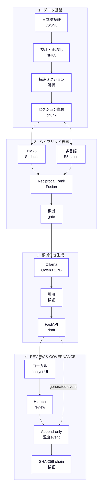

# JP Patent Intelligence RAG

日本のAI関連公開特許を対象とする、根拠追跡型・多言語RAGです。日本語の特許原文を
セクション単位で処理し、BM25と多言語ベクトル検索を統合した後、ローカルOllamaで
出典付きの回答を生成します。

> 必須実行コストは0円です。クラウド契約、APIキー、従量課金サービスを使用しません。

## 主な特徴

- NII LLM-jp Corpus v4を基にした公開特許46,794件の再現可能な年層化サンプル
- `【要約】`、個別の`【請求項】`、`【技術分野】`、`【背景技術】`等の構造化処理
- 韓国語特許用語展開、Sudachi BM25、384次元多言語E5-smallのハイブリッド検索
- Reciprocal Rank Fusionによるスコア尺度に依存しない順位統合
- ローカルQwen3 1.7Bによる日本語・韓国語・英語回答
- `[S1]`形式の引用検証、根拠不足時の回答保留、原文passage表示
- prompt・根拠・回答・処理時間・reviewerを記録するSHA-256連結型ローカル監査ログ
- draftに対する承認・修正依頼・却下のHuman-in-the-loop review
- FastAPI、Docker Compose、単体テスト、型検査、CI、検索評価レポート

## 開発プロセスと検証記録

完成画面だけでなく、Stage 0からStage 7までの開発順序、成果物、合格条件を保存しています。
コーパス・index・model weight・audit DBはローカルに残し、再現用command、manifest、測定値、
source code、検証snapshotのみをGitで管理します。

| Stage | 実装内容 | 合格条件 | 証拠 |
|---|---|---|---|
| **0 · 設計** | ローカルtrust boundary、必須コスト`$0`、Docker構成、評価契約を定義 | cloud account・有料API・外部model endpointが不要 | [Architecture](docs/ARCHITECTURE.md) · [Cost & privacy](docs/COST_AND_PRIVACY.md) |
| **1 · 取得・sampling** | LLM-jp日本語特許からSHA-256順位による再現可能な年層化1% sampleを作成 | **46,794件**、source shard countとhashを記録 | [Dataset manifest](DATASET_MANIFEST.json) · [Dataset guide](DATASET_README.md) |
| **2 · 検証・解析** | gzip/UTF-8/JSON検証、NFKC正規化、公開番号抽出、特許section分離 | invalid **0**、empty **0**、要約coverage **99.99%**、請求項 **99.98%** | [Pipeline snapshot](docs/evidence/DATA_PIPELINE_SNAPSHOT.md) · [Parser](src/patent_rag/parsing/japanese_patent.py) |
| **3 · chunk・index** | section-aware chunk、Sudachi BM25、384次元multilingual E5-smallを構築 | **31,270 chunks**、512-token上限超過 **0**、artifact hash一致 | [Embedding audit](docs/evidence/EMBEDDING_CONTEXT_AUDIT.md) · [Index snapshot](docs/evidence/FINAL_INDEX_AND_EVALUATION.md) |
| **4 · 検索評価** | BM25・dense・RRF hybridを日本語および韓国語/英語queryで比較 | 日本語hybrid Recall@5 **1.000**、KO/EN hybrid Recall@5 **1.000** | [Evaluation](docs/EVALUATION.md) · [Measured results](docs/evidence/FINAL_INDEX_AND_EVALUATION.md) |
| **5 · 根拠付き生成** | evidence gate、bounded prompt、structured output、citation allow-list、fallback、abstentionを実装 | 採用回答はretrieval済み`[S#]`だけを引用し、未許可citationは通過不可 | [Generation code](src/patent_rag/generation/ollama.py) · [Model card](docs/MODEL_CARD.md) |
| **6 · API・UI・governance** | FastAPI、原文dialog、独立review、canonical JSONのhash-linked audit eventを実装 | draftは`pending`開始、reviewは上書きせずappend、chain検証valid | [Audit & HITL](docs/AUDIT_AND_HITL.md) · [E2E evidence](docs/evidence/AUDIT_HITL_E2E_SNAPSHOT.md) |
| **7 · Runtime検証** | Dockerで検索→local生成→review→audit検証→CIをend-to-end実行 | `JP2020151725`がtop、non-root app、24-event chain valid、**30 tests** | [Docker evidence](docs/evidence/DOCKER_OLLAMA_SNAPSHOT.md) · [Build log](docs/BUILD_LOG.md) · [CI](https://github.com/Lee2379/jp-patent-intelligence-rag/actions) |

command、処理時間、artifact hash、失敗した試行と採用した修正を含む時系列記録は
[BUILD_LOG](docs/BUILD_LOG.md)に保存しています。

## アーキテクチャ


<details>
<summary><strong>Mermaid実装を表示</strong></summary>



</details>

## 実行

```powershell
uv sync --dev
Copy-Item .env.example .env
docker compose up -d ollama
docker compose --profile setup run --rm model-init
docker compose --profile setup run --rm embedding-init
uv run patent-rag prepare
uv run patent-rag report
uv run patent-rag build-index
uv run patent-rag evaluate
uv run uvicorn patent_rag.api.app:app --host 127.0.0.1 --port 8000
```

ブラウザで `http://127.0.0.1:8000` を開きます。詳細は `docs/RUNBOOK.md`、設計判断は
`docs/ARCHITECTURE.md`、評価上の制約は `docs/EVALUATION.md`を参照してください。

UIではanalystが自由入力の質問とfilterを指定し、回答中の引用から日本語原文を確認できます。
別のreviewer labelで承認・修正依頼・却下を記録すると、完全なmodel prompt、根拠、回答、
判断、時刻、chain hashを`/audit`で追跡できます。

## 検証結果

- 日本語silver benchmark 30問: Hybrid Recall@5 **100%**、MRR@10 **1.000**
- 韓国語・英語smoke check 6問: Hybrid Recall@5 **100%**、MRR@10 **0.700**
- Docker E2E: `JP2020151725`が1位、structured Ollama回答、human approval、24-event chain valid
- CPU cold-container生成 **29.9秒**、warm native E2E **8.3秒**
- Ruff、strict mypy、30 tests通過

これらは回帰確認用であり、専門家による先行技術・法的関連性評価ではありません。

## 利用上の注意

本システムは技術検索のポートフォリオであり、特許性、侵害、無効性、FTO、法的状態に
関する法的判断を提供しません。元データはCC BY 4.0、アプリケーションコードは
Apache-2.0です。
