# JP Patent Intelligence RAG

日本のAI関連公開特許を対象とする、根拠追跡型・多言語RAGです。日本語の特許原文を
セクション単位で処理し、BM25と多言語ベクトル検索を統合した後、ローカルOllamaで
出典付きの回答を生成します。

> 必須実行コストは0円です。クラウド契約、APIキー、従量課金サービスを使用しません。

## 主な特徴

- NII LLM-jp Corpus v4を基にした公開特許46,794件の再現可能な年層化サンプル
- `【要約】`、個別の`【請求項】`、`【技術分野】`、`【背景技術】`等の構造化処理
- 韓国語特許用語展開、Sudachi BM25、384次元多言語E5-smallのハイブリッド検索
- Reciprocal Rank Fusionによるスコア尺度に依存しない順位統合
- ローカルQwen3 1.7Bによる日本語・韓国語・英語回答
- `[S1]`形式の引用検証、根拠不足時の回答保留、原文passage表示
- prompt・根拠・回答・処理時間・reviewerを記録するSHA-256連結型ローカル監査ログ
- draftに対する承認・修正依頼・却下のHuman-in-the-loop review
- FastAPI、Docker Compose、単体テスト、型検査、CI、検索評価レポート

## アーキテクチャ

```mermaid
flowchart LR
    subgraph DATA["1 · データ基盤"]
        direction TB
        A["日本語特許<br/>JSONL"] --> B["検証・正規化<br/>NFKC"]
        B --> C["特許セクション<br/>解析"]
        C --> D["セクション単位<br/>chunk"]
    end

    subgraph SEARCH["2 · ハイブリッド検索"]
        direction TB
        E["BM25<br/>Sudachi"] --> G["Reciprocal Rank<br/>Fusion"]
        F["多言語<br/>E5-small"] --> G
        G --> H["根拠<br/>gate"]
    end

    subgraph GENERATE["3 · 根拠付き生成"]
        direction TB
        I["Ollama<br/>Qwen3 1.7B"] --> J["引用<br/>検証"]
        J --> K["FastAPI<br/>draft"]
    end

    subgraph GOVERN["4 · REVIEW & GOVERNANCE"]
        direction TB
        U["ローカル<br/>analyst UI"] --> R["Human<br/>review"]
        R --> L["Append-only<br/>監査event"]
        L --> Z["SHA-256 chain<br/>検証"]
    end

    D --> E
    D --> F
    H --> I
    K --> U
    K -. generated event .-> L

    classDef default fill:#ffffff,stroke:#6d5dfc,stroke-width:1.5px,color:#17152b,font-size:16px;
    style DATA fill:#f7f7ff,stroke:#c9c4ff,stroke-width:1px
    style SEARCH fill:#f7f7ff,stroke:#c9c4ff,stroke-width:1px
    style GENERATE fill:#f7f7ff,stroke:#c9c4ff,stroke-width:1px
    style GOVERN fill:#f7f7ff,stroke:#c9c4ff,stroke-width:1px
```



## 実行

```powershell
uv sync --dev
Copy-Item .env.example .env
docker compose up -d ollama
docker compose --profile setup run --rm model-init
docker compose --profile setup run --rm embedding-init
uv run patent-rag prepare
uv run patent-rag report
uv run patent-rag build-index
uv run patent-rag evaluate
uv run uvicorn patent_rag.api.app:app --host 127.0.0.1 --port 8000
```

ブラウザで `http://127.0.0.1:8000` を開きます。詳細は `docs/RUNBOOK.md`、設計判断は
`docs/ARCHITECTURE.md`、評価上の制約は `docs/EVALUATION.md`を参照してください。

UIではanalystが自由入力の質問とfilterを指定し、回答中の引用から日本語原文を確認できます。
別のreviewer labelで承認・修正依頼・却下を記録すると、完全なmodel prompt、根拠、回答、
判断、時刻、chain hashを`/audit`で追跡できます。

## 検証結果

- 日本語silver benchmark 30問: Hybrid Recall@5 **100%**、MRR@10 **1.000**
- 韓国語・英語smoke check 6問: Hybrid Recall@5 **100%**、MRR@10 **0.700**
- Docker E2E: `JP2020151725`が1位、structured Ollama回答、human approval、24-event chain valid
- CPU cold-container生成 **29.9秒**、warm native E2E **8.3秒**
- Ruff、strict mypy、30 tests通過

これらは回帰確認用であり、専門家による先行技術・法的関連性評価ではありません。

## 利用上の注意

本システムは技術検索のポートフォリオであり、特許性、侵害、無効性、FTO、法的状態に
関する法的判断を提供しません。元データはCC BY 4.0、アプリケーションコードは
Apache-2.0です。
