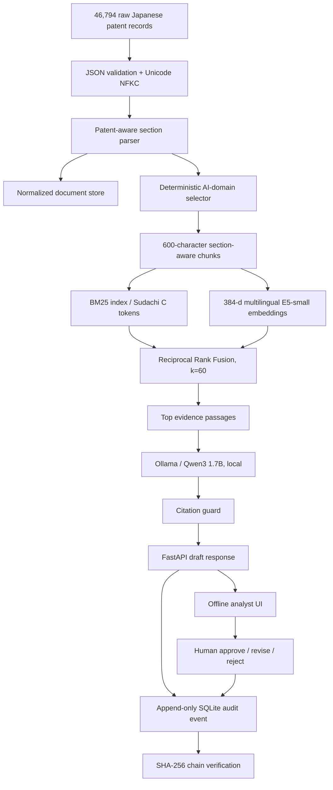
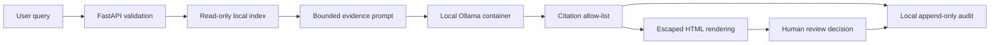

# Architecture

## Design objective

Answer multilingual technical questions about Japanese AI patents while keeping every
claim traceable to a Japanese source passage. The required system must run on one laptop,
without an API key or metered infrastructure.

## Data flow

## Why this is not a toy RAG

1. **Domain parsing:** claims are kept separate from the abstract and detailed description.
   This prevents a retrieved claim from being presented as background art.
2. **Hybrid retrieval:** Japanese lexical match is strong for patent terminology and public
   numbers, while multilingual embeddings make Korean and English questions usable.
   E5 receives its required asymmetric `query:` and `passage:` prefixes, and the 600-character
   chunk cap was selected from a tokenizer audit against its 512-token context window.
   Korean input also receives a transparent deterministic Japanese patent-term expansion on the
   BM25 branch; the original input is preserved for dense retrieval and in the audit event.
3. **Fusion, not score mixing:** BM25 and cosine scores have incompatible scales. Reciprocal
   Rank Fusion combines ranks without pretending the raw scores are calibrated.
4. **Structured citation enforcement:** Ollama must return a JSON-schema object whose problem and
   solution each contain an allow-listed source-ID array. The API deterministically composes the
   conclusion, citations, and scope limitation; invalid output falls back to extractive evidence.
5. **Evidence gate:** generation requires an exact publication-ID match or a technical-domain cue
   plus a corpus-calibrated dense score; failed queries abstain while still exposing weak hits.
   A relative-RRF coherence filter then sends only strong top passages (at least two when
   available) to the LLM, while the UI and audit record retain the full retrieval set.
6. **Graceful degradation:** retrieval and source inspection still work if Ollama is stopped.
7. **Reproducibility:** source hashes, selection rules, index manifest, fixed seed, tests, and
   a silver retrieval benchmark are recorded.
8. **Governance:** prompts, passages, generated drafts, citations, timings, and review decisions
   are appended to a local SQLite event chain; answers begin in `pending` review state.

## Trust boundaries

- Raw patent text is untrusted content, never executable instructions.
- The model has no tools, shell, network browser, or write access.
- The browser escapes all API text before inserting it into the page.
- Docker ports bind to `127.0.0.1`, not the public network.

## Scaling path

The portfolio index targets the AI-domain subset of the reproducible 1% corpus. Scaling to
all Japanese patents keeps the parser and evaluation contract, but would replace in-memory
dense search with a local disk ANN index and add incremental indexing. That is deliberately
not required for this laptop demo.
