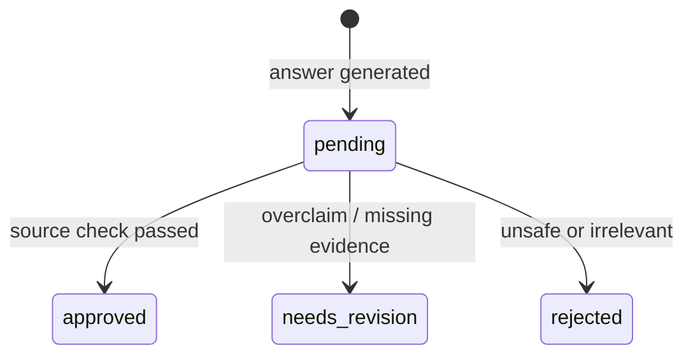

# Audit trail and human-in-the-loop review

## Control objective

Every generated answer must be reconstructable from the local record: who submitted the prompt,
which filters and passages were used, what the local model returned, which citations were accepted,
how long each stage took, and what a human reviewer decided.

The required path remains fully local and free. Audit data is stored in
`artifacts/audit/audit.sqlite3`; the database, WAL, and shared-memory files are excluded from Git
because they contain prompts and answers.

## Recorded events

`search_performed` records:

- self-declared local `actor_id` and optional browser session ID
- exact prompt, year/section filters, requested top K
- source IDs, Japanese passages, local paths, BM25/dense/RRF scores
- retrieval latency

`answer_generated` additionally records:

- complete draft answer, generation mode and local model
- raw model output and the separate citation-validation result, even when a safe fallback is shown
- exact system prompt, evidence-expanded user prompt, and generation parameters sent to Ollama
- validated `[S#]` citations and grounded flag
- retrieval, generation, and total latency
- whether review is required and the initial `pending` state

`review_decision` records:

- reviewer operator label
- `approved`, `needs_revision`, or `rejected`
- optional reviewer note
- the answer event ID being reviewed

No audit-delete endpoint exists.
SQLite `BEFORE UPDATE` and `BEFORE DELETE` triggers also reject mutation through ordinary database
statements; new information is represented by a new event.

## Tamper-evident chain

Events are appended in a single SQLite transaction. Each event stores the prior event hash and a
SHA-256 digest over canonical JSON containing its ID, timestamp, event type, actor, subject,
payload, and previous hash. `/api/audit/verify` recomputes the chain from the genesis record and
fails at the first changed or reordered event.
If verification fails, the health state degrades and search, generation, and review endpoints
return `503`; inspection and verification endpoints remain available for diagnosis.

This is tamper-evident, not an immutable external ledger: an administrator with filesystem access
could replace the entire database and application. Production hardening would periodically anchor
the head hash in a separately controlled signed store.

## Human review state



The UI labels generated prose as a draft and provides a reviewer label separate from the analyst
label. Each decision creates a new audit event; the original answer event is never overwritten.
The API rejects a review when the reviewer label equals the answer author's label, enforcing a
local four-eyes workflow at the operator-label level. The latest review event determines the
displayed state.

## Local endpoints

| Endpoint | Purpose |
|---|---|
| `POST /api/answer` | Generate a pending draft and return its audit receipt |
| `POST /api/review` | Append a human decision linked to an answer event |
| `GET /api/audit/events` | Inspect recent local events |
| `GET /api/audit/events/{event_id}` | Reconstruct one event and current review state |
| `GET /api/audit/verify` | Recompute and verify the full hash chain |
| `GET /audit` | Open the portfolio audit console |

The chain can also be checked while the API is stopped:

```powershell
uv run patent-rag verify-audit
```

## Identity and privacy boundary

`actor_id` and `reviewer_id` are operator-supplied labels, not authenticated identities. Therefore
the label-level four-eyes check is a portfolio control, not proof of real-world identity. The UI
says this explicitly. A production deployment would use SSO, authorization roles, and signed
workload identity. Prompts may contain sensitive text, so the app binds to loopback, does not
export audit events, and keeps the audit database out of version control.
