# Japanese Patent Intelligence RAG

**日本語** · [English](README.md)

## プロジェクト概要

- **解決した課題:** 日本語特許のキーワード検索、多言語での質問、回答生成、レビュー判断が別々のツールに分かれていると、回答の根拠と承認履歴を追跡しにくくなります。
- **実装したもの:** 特許セクションの解析、Sudachi BM25と多言語埋め込みの統合検索、回答に使った原文の表示、レビュアーの判断を追記するハッシュチェーンを一つのローカルアプリにまとめました。
- **結果:** 46,794件のサンプルを検証し、AI関連505文書を31,270チャンクとしてインデックス化しました。unit／APIテストは30件あり、検索評価の条件と制約は[`docs/EVALUATION.md`](docs/EVALUATION.md)に記載しています。
- **担当範囲:** 検索・レビューワークフローの設計、パーサー、インデックス、回答検証、FastAPI、web UI、監査ログ、Docker構成、評価コードを実装しました。
- **確認方法:** [画面とワークフロー](#プロダクト概要)を確認するか、[クイックスタート](#クイックスタート)から有料APIなしでローカル実行できます。

> **利用範囲:** 技術的な先行技術探索を支援するツールです。法的助言、特許性、権利帰属、他社特許を侵害せず実施できるかどうかの判断には使用できません。

## データの出所と前処理

開発コーパスには、LLM-jp Corpus構築ワーキンググループ（国立情報学研究所）が公開し、
Hugging Faceにもミラーされている **LLM-jp Corpus v4** の `ja_patent` サブセットを使用しています。
本リポジトリではコーパス自体を再配布せず、マニフェスト、検証資料、再現可能な処理コードのみを
管理しています。

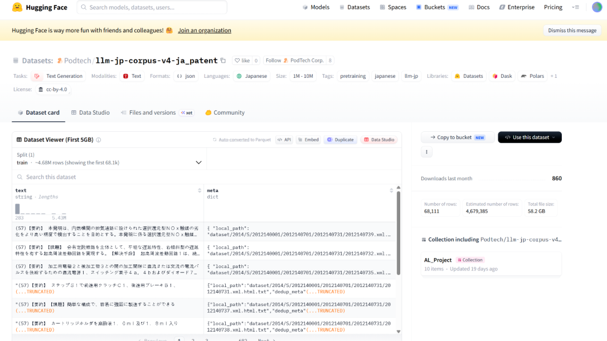

*図1. 初期開発データとして使用した日本語特許コーパス。約468万件の文書を収録し、
CC BY 4.0で配布されています。*

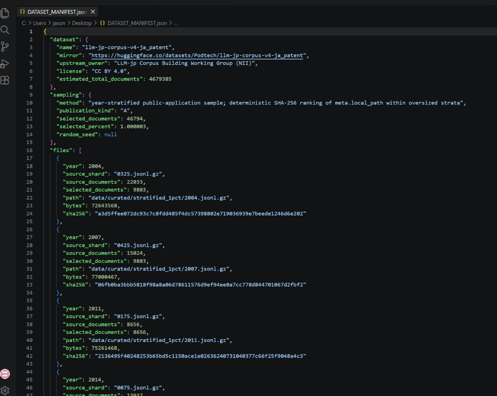

*図2. 再現可能なサンプリングマニフェスト。推計4,679,385件の原データから、年別に層化した
46,794件の決定論的サンプルを作成し、各整形済みシャードのSHA-256チェックサムを記録しています。*

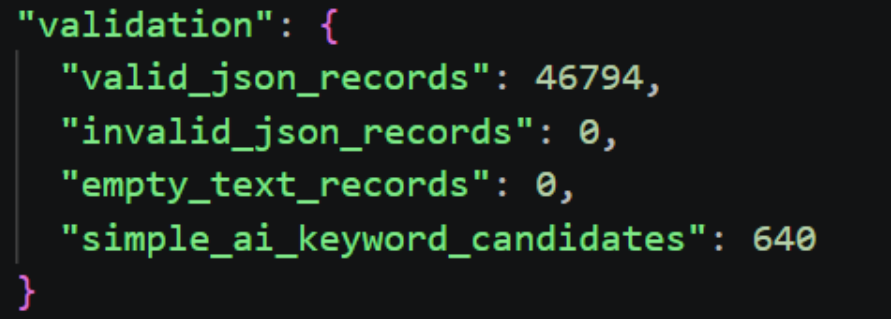

*図3. コーパスの完全性検証。46,794件すべてがgzip、UTF-8、JSONの検証を通過し、
特許本文が欠落したレコードは0件でした。*

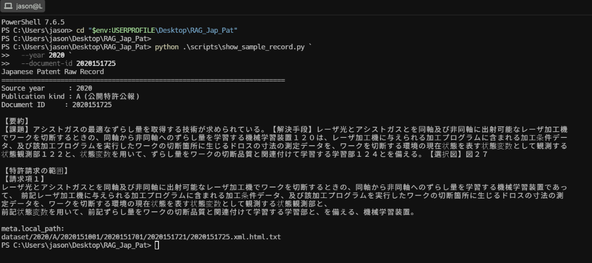

*図4. 機械学習に関する要約、独立請求項、公開情報、追跡可能なソースパスを含む
日本語特許の原レコード。*

| データ契約 | 値 |
|---|---:|
| 上流コーパスの推計件数 | 日本語特許レコード 4,679,385件 |
| 再現可能なサンプル | 46,794件（1.000003%） |
| 対象年 | 2004、2007、2011、2014、2017、2020 |
| 公開種別 | `A` — 公開特許公報 |
| 有効／無効／空データ | 46,794／0／0 |
| インデックス対象のAI関連文書 | 505件 |

データの出所、利用条件、帰属表示の詳細は、[DATASET_README.md](DATASET_README.md)、
[DATASET_MANIFEST.json](DATASET_MANIFEST.json)、および
[ローカルデータセットカード](docs/sources/LLM_JP_DATASET_CARD.md)を参照してください。

## 開発プロセスと検証記録

本リポジトリは最終画面だけでなく、完了した開発工程全体を保存しています。各工程には明示的な
成果物、受入基準、永続的な検証資料があります。生成したコーパス、インデックス、モデル重み、
監査データベースはローカル環境に保持し、マニフェスト、測定値、ソースコード、再現コマンドのみを
バージョン管理しています。

| 工程 | 実装内容 | 受入基準 | 検証資料 |
|---|---|---|---|
| **0 · アーキテクチャ** | ノートPC内で完結する信頼境界、必須外部サービス費用`$0`の方針、Docker構成、評価契約を定義 | クラウドアカウント、有料API、外部モデルエンドポイントが不要 | [アーキテクチャ](docs/ARCHITECTURE.md) · [コストとプライバシー](docs/COST_AND_PRIVACY.md) |
| **1 · 取得とサンプリング** | LLM-jpの日本語特許シャードを取得し、SHA-256順位に基づく再現可能な年別層化1%サンプルを作成 | **46,794件**を選定し、原シャードの件数とハッシュを記録 | [データセットマニフェスト](DATASET_MANIFEST.json) · [データセットガイド](DATASET_README.md) |
| **2 · 検証と解析** | gzip／UTF-8／JSONを検証し、NFKC正規化、公開番号抽出、特許セクション分離を実施 | 無効JSON **0件**、空テキスト **0件**、要約収録率 **99.99%**、請求項収録率 **99.98%** | [パイプラインスナップショット](docs/evidence/DATA_PIPELINE_SNAPSHOT.md) · [`japanese_patent.py`](src/patent_rag/parsing/japanese_patent.py) |
| **3 · チャンク化とインデックス構築** | 長さを制限したセクション単位のチャンク、Sudachi BM25、384次元の多言語E5-small埋め込みを構築 | **31,270チャンク**、保存チャンクはすべて512トークン以内、成果物ハッシュが一致 | [埋め込み監査](docs/evidence/EMBEDDING_CONTEXT_AUDIT.md) · [インデックススナップショット](docs/evidence/FINAL_INDEX_AND_EVALUATION.md) |
| **4 · 検索評価** | 日本語および韓国語／英語の回帰テストセットで、疎検索、密検索、RRFハイブリッド検索を比較 | 日本語Hybrid Recall@5 **1.000**、韓国語／英語Hybrid Recall@5 **1.000** | [評価プロトコル](docs/EVALUATION.md) · [測定結果](docs/evidence/FINAL_INDEX_AND_EVALUATION.md) |
| **5 · 根拠に基づく生成** | 根拠ゲート、範囲を限定したOllamaプロンプト、構造化出力、引用許可リスト、フォールバック、回答保留を実装 | 採用可能な回答は検索済みの`[S#]`のみを引用し、未許可の引用は検証を通過しない | [`ollama.py`](src/patent_rag/generation/ollama.py) · [モデルカード](docs/MODEL_CARD.md) |
| **6 · API、UI、ガバナンス** | 型付きFastAPIエンドポイント、原文ダイアログ、独立したレビュー判断、正規化JSONによるハッシュ連結監査イベントを実装 | 下書きは`pending`で開始し、レビューは上書きせず追記、チェーン検証結果は有効 | [監査・HITL設計](docs/AUDIT_AND_HITL.md) · [E2E検証資料](docs/evidence/AUDIT_HITL_E2E_SNAPSHOT.md) |
| **7 · 実行環境の検証** | 検索、ローカル生成、レビュー、監査検証、CI品質ゲートまでのDockerワークフローを実行 | 最上位結果`JP2020151725`、非rootアプリ、有効な24イベントチェーン、Ruff、strict mypy、**30テスト** | [Docker検証資料](docs/evidence/DOCKER_OLLAMA_SNAPSHOT.md) · [ビルドログ](docs/BUILD_LOG.md) · [CI](https://github.com/Lee2379/jp-patent-intelligence-rag/actions) |

コマンド、実測時間、成果物ハッシュ、失敗した試行、採用した修正を含む時系列の全記録は、
[ビルドログ](docs/BUILD_LOG.md)に保存しています。これにより、ライセンス対象のコーパスや
端末固有の実行状態をGitに含めることなく、開発工程を監査できます。

## プロダクト概要

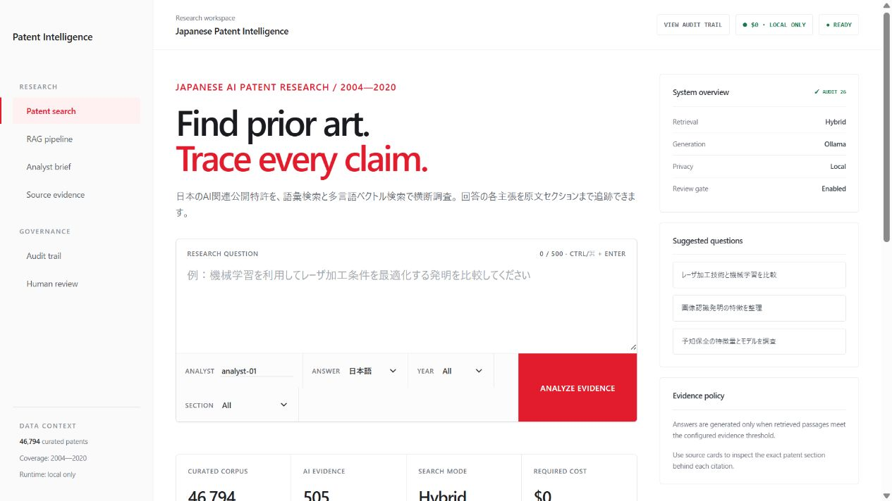

*ローカル日本語特許インテリジェンスRAG — ハイブリッド検索、多言語回答、完全ローカル推論。*

このインターフェースは汎用的なチャットデモではなく、分析担当者向けのワークスペースとして
設計されています。コーパスの対象範囲、フィルター、検索方式、モデル状態、根拠ポリシー、
原文パッセージ、レビュー判断、監査レシートを一つのワークフロー上で確認できます。

## 本プロジェクトで実証する内容

- **日本語特許NLP:** Unicode正規化に加え、要約、個別請求項、技術分野、背景技術、
  発明を実施するための形態をセクション単位で抽出します。
- **ハイブリッド情報検索:** Sudachiでトークン化したBM25と多言語E5-smallによる密検索を、
  互換性のない生スコア同士を直接混合せず、Reciprocal Rank Fusionで統合します。
- **多言語検索:** 日本語回答に加え、韓国語・英語のクエリに対応します。語彙検索側では、
  韓国語から日本語への特許用語展開を明示的に適用します。
- **根拠に基づくローカル生成:** Ollama `qwen3:1.7b`、範囲を限定した根拠プロンプト、
  許可リスト方式の`[S#]`引用、根拠ゲート、抽出的フォールバック、回答保留を組み合わせています。
- **運用上のAI統制:** 独立した承認／修正依頼／却下の判断と、プロンプト、パッセージ、出力、
  処理時間、レビューを記録する追記専用のSHA-256連結イベントを実装しています。
- **工学的品質管理:** 型付きFastAPI契約、Docker Compose、決定論的テスト、検索評価、Ruff、
  strict mypy、CI、Runbook、モデルカード、脅威境界を整備しています。

## エンドツーエンド・アーキテクチャ

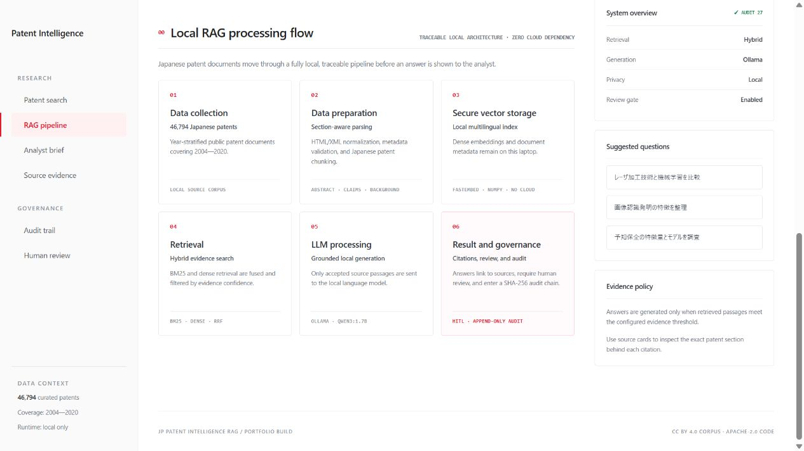

*エンドツーエンドのローカルRAGアーキテクチャ — 日本語特許の取り込み、セクション単位の解析、
ハイブリッド検索、根拠に基づく生成、ガバナンス。*

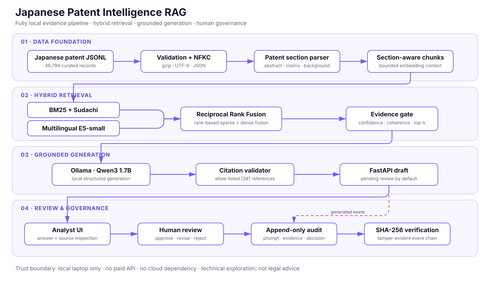

<details>
<summary><strong>Mermaidによる実装図を表示</strong></summary>

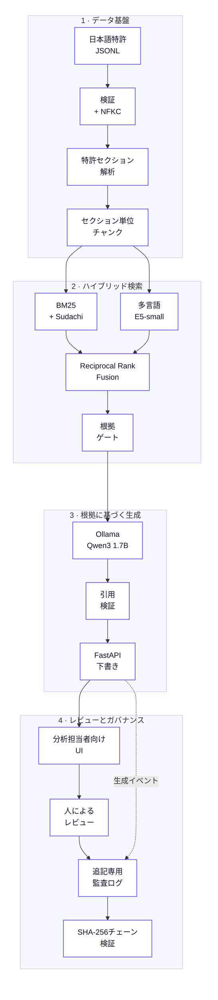

</details>

ローカルモデルに渡されるのは、設定した根拠しきい値を満たす検索パッセージだけです。
モデルにはブラウザー、シェル、ツール、書き込み権限を与えていません。APIから受け取るテキストは
UIへの描画前にエスケープし、Dockerのポートは`127.0.0.1`にバインドしています。

## 根拠付き回答と引用の追跡

<details>
<summary><strong>根拠スコアと[S1]／[S2]引用を含む日本語回答を表示</strong></summary>

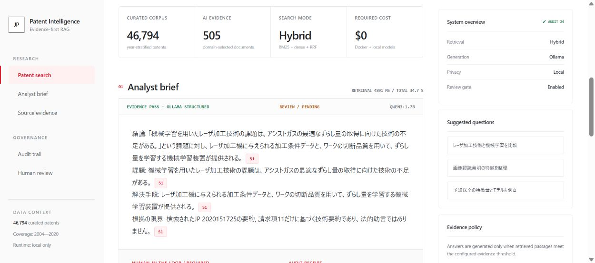

*根拠に基づく生成 — 分析担当者は、根拠判定、使用モデル、処理時間、日本語回答、
インライン引用、順位付けされた原文パッセージを確認できます。*

</details>

回答中の引用はすべて操作可能で、主張の根拠として使用した特許セクションを直接開けます。

<details>
<summary><strong>引用単位の原文確認を表示</strong></summary>

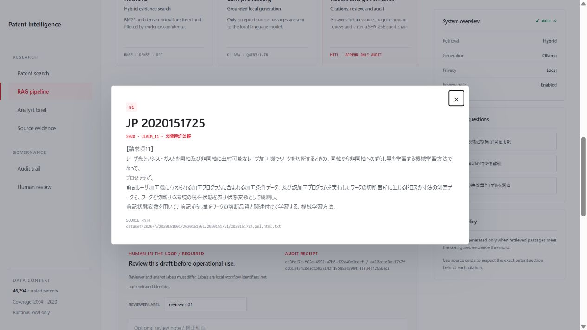

*引用単位の追跡 — 生成された各主張から、公開番号、公開年、セクション、ローカルソースパスを含む
日本語特許の根拠箇所を直接確認できます。*

</details>

## Human-in-the-loopレビュー

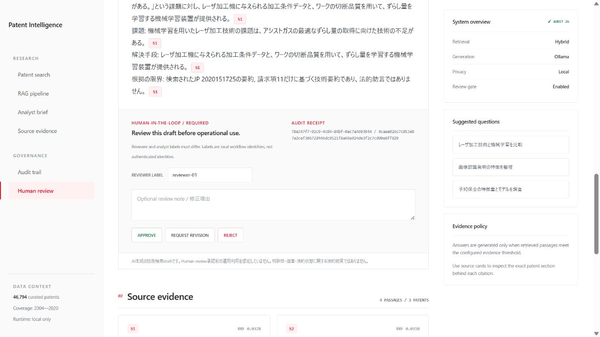

*Human-in-the-loopレビューゲート — 生成されたすべての回答に対して、独立した承認、修正依頼、
または却下の判断を記録します。*

回答は`pending`状態で開始します。レビュー担当者のラベルは分析担当者のラベルと異なる必要があり、
新しい判断イベントは生成済みの下書きを上書きせずに記録されます。これらのラベルは本ローカル
ポートフォリオ内のワークフロー識別子であり、認証済みの利用者IDではありません。

## 改ざん検知可能な監査証跡

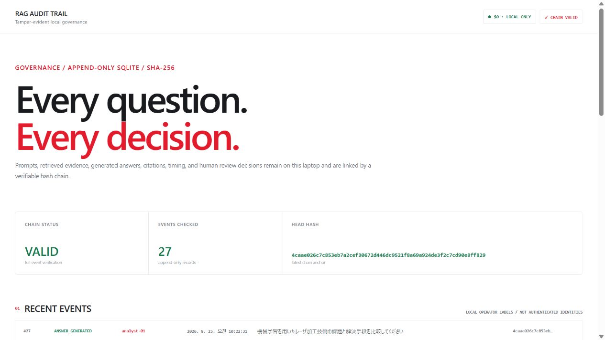

*改ざん検知可能な監査証跡 — プロンプト、検索根拠、モデル出力、人による判断を、
追記専用のSHA-256チェーンで連結します。*

正規化した各JSONイベントには、一つ前のイベントハッシュを保存します。検証時にはチェーンを
再計算し、確認済みイベント数、現在の先頭ハッシュ、有効性を返します。これによりローカルでの
密かな変更を検知できます。本番環境では、これに加えて利用者認証、アクセス制御、リモートの
イミュータブルストレージ、保存期間ポリシー、外部タイムスタンプが必要です。

## クイックスタート

前提環境はDocker DesktopとPython 3.11です。NVIDIA GPUは任意で、CPUのみでも推論できます。
原データと生成済みインデックスは意図的にGitの管理対象外としています。

```powershell
git clone https://github.com/Lee2379/jp-patent-intelligence-rag.git
cd jp-patent-intelligence-rag
Copy-Item .env.example .env
uv sync --dev

docker compose up -d ollama
docker compose --profile setup run --rm model-init
docker compose --profile setup run --rm embedding-init

uv run patent-rag prepare
uv run patent-rag report
uv run patent-rag build-index
uv run patent-rag evaluate
docker compose --profile app up -d --build
```

`http://127.0.0.1:8000`を開いてください。監査コンソールは
`http://127.0.0.1:8000/audit`で利用できます。事前に、
[DATASET_README.md](DATASET_README.md)で指定したパスへコーパスを配置する必要があります。
ネイティブ実行、CPU用Composeオーバーライド、ヘルスチェック、トラブルシューティングについては、
[Runbook](docs/RUNBOOK.md)を参照してください。

## リポジトリ構成

```text
apps/web/                  分析担当者向けUIおよび監査UI
src/patent_rag/parsing/    日本語特許のセクション解析
src/patent_rag/pipeline/   検証、正規化、チャンク化、レポート生成
src/patent_rag/retrieval/  BM25、密検索、RRF、検索評価
src/patent_rag/generation/ Ollamaプロンプトと引用ガード
src/patent_rag/api/        FastAPIアプリケーションと型付き契約
src/patent_rag/audit.py    追記専用SQLiteイベントとハッシュチェーン検証
tests/                     決定論的な単体テストおよびAPIテスト
docs/                      アーキテクチャ、検証資料、評価、Runbook、モデルカード
```

## 設計判断と制約

- 505件のAI関連文書を対象とする現在の構成では、メモリ上の密検索が適切です。コーパス全体へ
  拡張する場合は、ディスクベースのANNインデックスと増分取り込みが必要です。
- 本コーパスには、最新かつ完全な法的状態、出願人、CPC／FI、引用ネットワークのメタデータは
  含まれていません。これらの項目には、権限を得て利用する最新の特許庁データソースが必要です。
- 有効なハッシュチェーンはローカルでの変更を検知できますが、本人性、認可、外部タイムスタンプを
  保証するものではありません。
- 生成テキストは、常に人が確認する技術検索上の下書きです。特許性、侵害、特許の有効性、
  FTO、権利帰属、法的状態の判断には使用できません。

詳細は、[アーキテクチャ](docs/ARCHITECTURE.md)、
[監査・HITL設計](docs/AUDIT_AND_HITL.md)、
[コストとプライバシー](docs/COST_AND_PRIVACY.md)、[セキュリティポリシー](SECURITY.md)を
参照してください。

## ライセンスと帰属表示

アプリケーションコードは[Apache-2.0](LICENSE)でライセンスされています。日本語特許コーパスは
**CC BY 4.0**の下で別途配布されており、帰属先はLLM-jp Corpus構築ワーキンググループ（NII）
および上流コーパスに記載された原データ提供者です。モデルとサードパーティ依存関係には、
それぞれのライセンスが適用されます。
